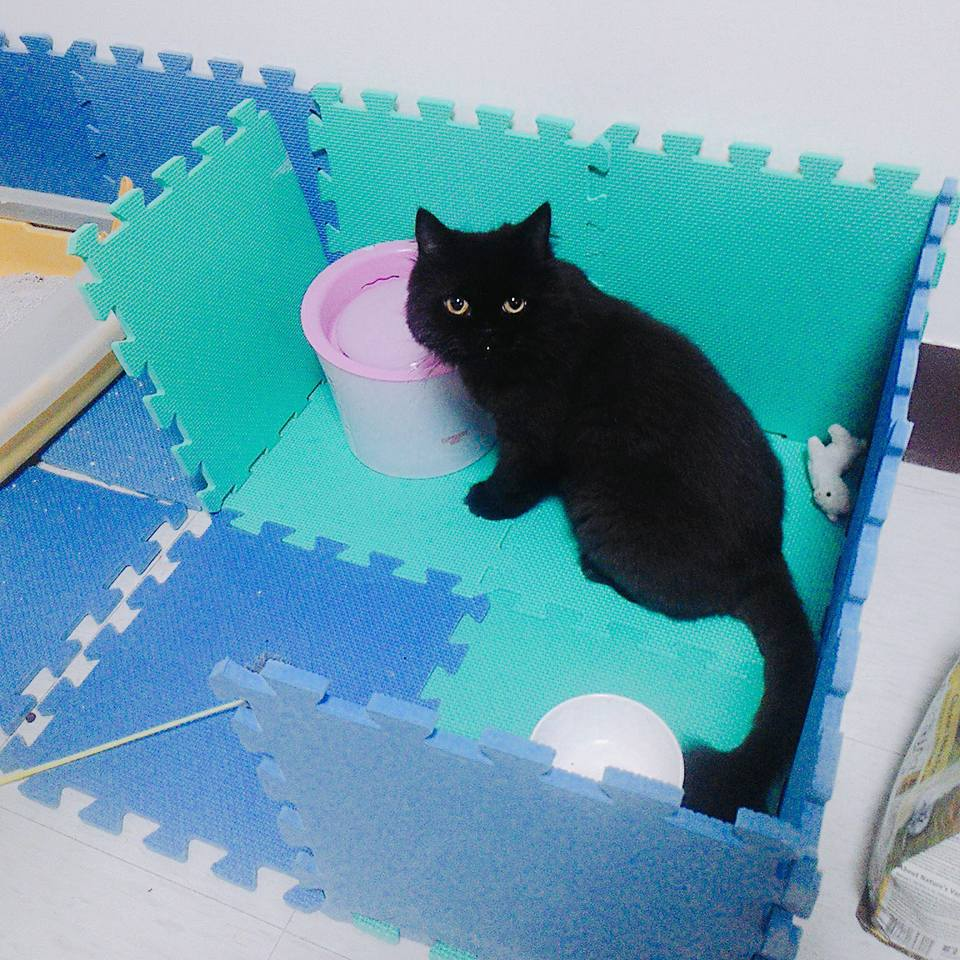
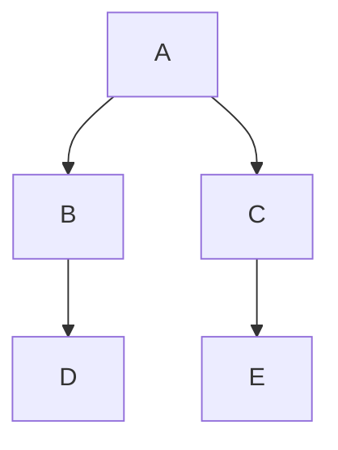
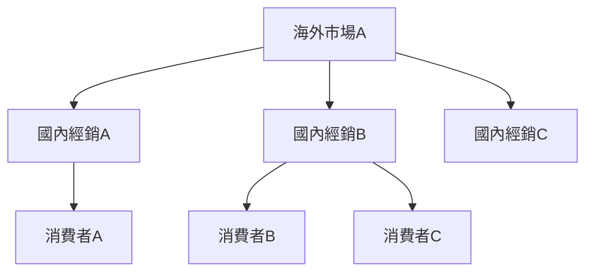
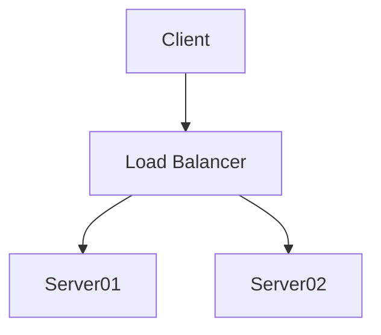

# 1. Title1

## Title1.1 <!-- omit in toc -->

## 1.1. Title2

### 1.1.1. Title2.1

- Item1
  - Item1.1
- Item2
- Item3
- Item4
  - Item1.1
  - Item1.2

normal
**multiply words**
**bold**
**wordUnderCursor**
**jumpOut**

- [x] todo
- [x] todo
- [ ] todo

- [1. Title1](#1-title1)
  - [1.1. Title2](#11-title2)
    - [1.1.1. Title2.1](#111-title21)
  - [1.2. Introduction](#12-introduction)
  - [1.3. Background](#13-background)
    - [1.3.1. Issues](#131-issues)
  - [1.4. Team Composition](#14-team-composition)

## 1.2. Introduction

## 1.3. Background

### 1.3.1. Issues

## 1.4. Team Composition

| 左 | 中 | 右 |
| :--- | :---: | ---: |
| 45 | 46 | 47 |
| 1  | 2  |  3 |
|    |    |    |

$$
f(x) = \int_{-\infty}^{\infty}
    \hat f(\xi)\,e^{2 \pi i \xi x}
    \,d\xi
$$



This is [a link][link id]

[link id]:https://marketplace.visualstudio.com/items?itemName=yzhang.markdown-all-in-one

This is [a link](https://marketplace.visualstudio.com/items?itemName=yzhang.markdown-all-in-one).

**bold**
*italic*

heading

==5==

- [x] buy box







這兩個字將會變成 **粗體**

***將這一段變成粗體加斜體***

~~將這段文字刪除~~

---
`<code>`

```ruby
require 'redcarpet'
markdown = Redcarpet.new("Hello World!")
puts markdown.to_html
```

```javascript {.class1 .class}
function add(x,y) {
    return x + y
}
```

```javascript {.line-numbers}
function add(x, y)  {
   return x + y
}
```

```javascript {highlight=10}
```

- [x] @mentions, #refs, [links](https://marketplace.visualstudio.com/items?itemName=jebbs.markdown-extended), **formatting** ,and ~~tags~~ supported
- [ ] list sysntax required (any unordered list supported)

| a   | b   |
| --- | --- |
| >   | 1   |
| 2   |

| a   | b   |
| --- | --- |
| 1   | 2   |
| ^   | 4   |

30^TH^

H~2~O

Content [^1]

[^1] : Hi! This is a footnote

==marked==
:smile:

:fa-car:

!!! note
    This is the **note** admonition body

!!! danger ""
    This is the **danger** admonition body
